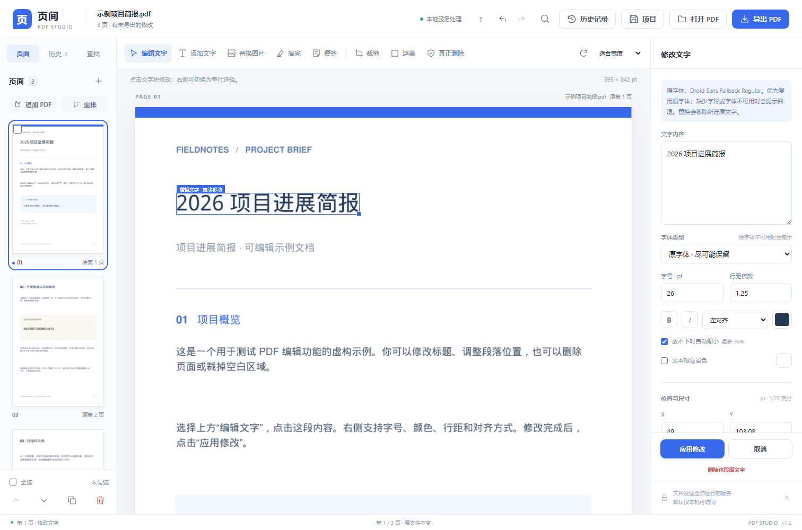
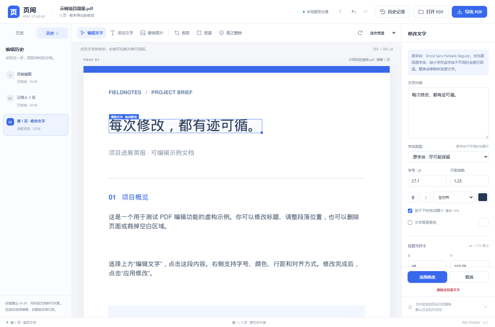
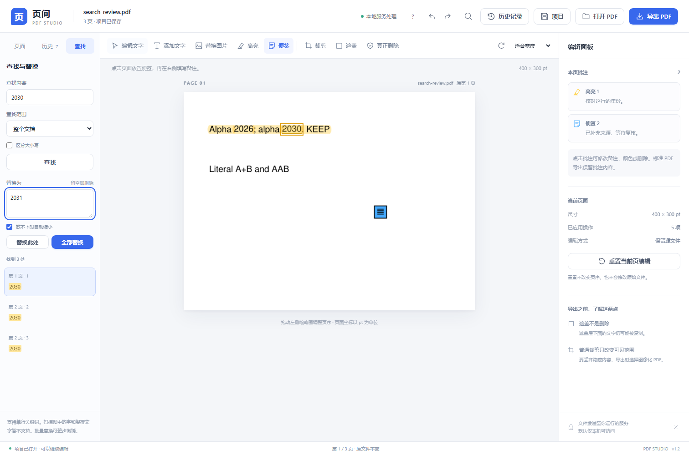
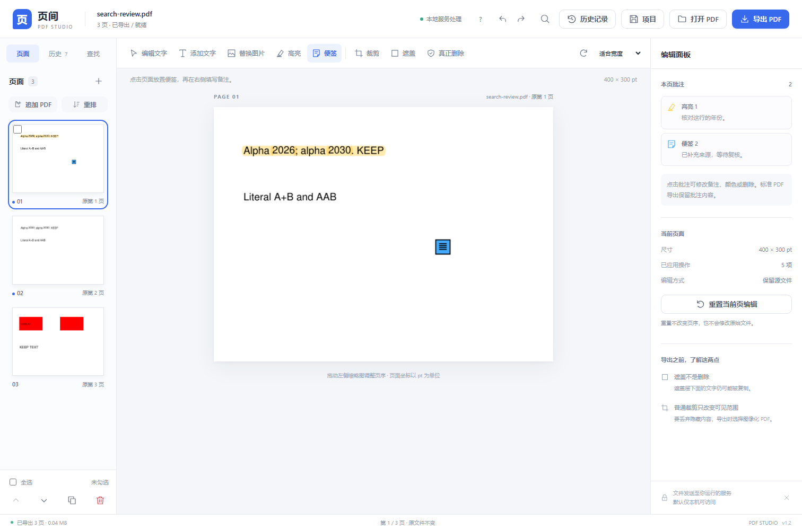
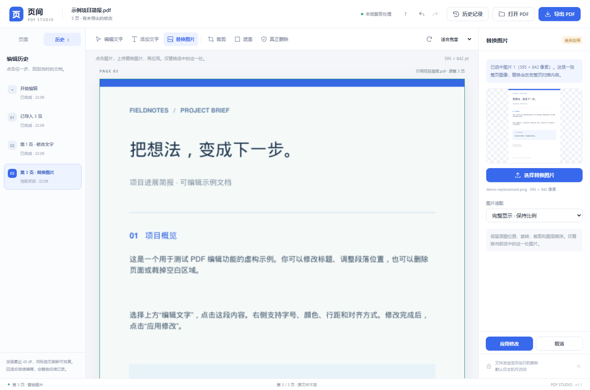

# 页间 · PDF Studio

一个本地优先、以网页为入口的 PDF 编辑器。支持文字块替换与局部排版、查找与批量替换、图片替换、高亮和便签、可回退的编辑历史、页面整理，以及 PDF 导出。可保存包含源文件和历史的项目文件，跨服务重启继续编辑。

**这是可以启动的完整源码工程，不是界面模型。** 前端不需要 npm 或构建；Python 服务提供 PDF 解析、预览和导出。默认只监听本机。



源码仓库：[xchang1121/local-pdf-editor](https://github.com/xchang1121/local-pdf-editor)。v1.2 增加查找与批量替换、原生高亮/便签、可重新打开的 `.pdfstudio` 项目文件。更新后需启动新版服务以加载新接口；若旧服务中还有编辑，请先保存项目（v1.2 起支持）或导出 PDF，也可用 `python run.py --port 8004` 在空闲端口启动新版后迁移。

## 快速开始

需要 **Python 3.10–3.13**。最新调试已在 Windows + Python 3.12.5 验证；此前版本在 Linux + Python 3.13.5 验证。推荐使用 Python 3.11、3.12 或 3.13；固定依赖未在 Python 3.14 及更新版本上验证。

解压后进入 `pdf-studio` 文件夹：

**Windows**：双击 `start.bat`。安装 Python 时需要勾选加入 PATH；脚本也识别 `py` 启动器。

**macOS / Linux**：在终端运行：

```bash
bash start.sh
```

也可以在任意平台的终端运行：

```bash
python run.py
```

启动器会在项目中建立 `.venv`，仅在缺少匹配的运行依赖时执行安装。**首次安装需要联网**；运行编辑器本身不需要云 API、CDN 或互联网。看到服务启动完成后，在浏览器打开：

```text
http://127.0.0.1:8000
```

不要直接双击 `index.html`，它需要同源的后端 API。启动期间不要关闭终端；按 `Ctrl+C` 停止服务。端口被占用时运行 `python run.py --port 8001`，并打开相应端口。

### 手动安装

不使用启动脚本时：

```bash
python -m venv .venv
```

macOS / Linux：

```bash
source .venv/bin/activate
```

Windows PowerShell（策略不允许激活时，直接用 `.venv\Scripts\python.exe` 替代下面的 `python`）：

```powershell
.venv\Scripts\Activate.ps1
```

然后执行：

```bash
python -m pip install -r requirements.txt
python -m uvicorn app.main:app --host 127.0.0.1 --port 8000 --workers 1 --no-access-log
```

**必须保持一个 API worker**。会话存在该进程的内存中，PDF 任务则统一交给一个独立子进程执行；增加 Uvicorn workers 会导致请求落到不同会话空间。不要使用 `--reload` 处理需要保留的编辑会话。

### Docker（可选）

提供了 Dockerfile 与 Compose 配置，供自行构建；**本次没有实际构建/验证 Docker 镜像**。

```bash
docker compose up --build
```

仍然打开 `http://127.0.0.1:8000`。Compose 只把端口发布到本机，容器使用非 root 用户、只读根文件系统和临时目录。源文件会话不持久化。停止容器后，未导出的编辑工作会丢失。这些配置不是对恶意 PDF 的完整安全隔离保证。

## 功能与操作

| 功能 | 使用方式与范围 |
| --- | --- |
| 修改原文字 | 切换“编辑文字”，点击原有水平文字块；右侧可改为单行选择。修改后点击“应用修改”。 |
| 局部排版 | 改文字、字号、颜色、字体类别、加粗、斜体、对齐、行距；拖动文本框改变位置，拖动右下角改变尺寸，或填精确坐标。 |
| 新增文字 | 切换“添加文字”，在页面拖出文本框，在右侧输入并应用。 |
| 删除文字 | 选择原文字后点“删除这段原文字”，移除选中字形内容。 |
| 查找与替换 | 左侧“查找”或 Ctrl / ⌘ F，选择全文/当前页，点击结果定位；支持区分大小写、单处或整批替换。 |
| 高亮与便签 | 高亮工具拖选文字/区域，便签工具点击页面写备注；可修改颜色、不透明度、备注或删除。 |
| 替换图片 | 选择“替换图片”，点击图片框或右侧图片列表，上传 PNG/JPEG/WebP，选择完整显示、填满裁切或拉伸，再应用。 |
| 删除/排序页面 | 左侧勾选后批量删除；拖动缩略图排序、用上下箭头移动，或点“重排”输入完整页序。 |
| 复制/插入 | 复制当前页，或通过左侧 `+` 新建空白页。 |
| 合并/提取 | “追加 PDF”合并；导出时输入页码范围或指定次序，提取所需页面。 |
| 裁剪 | 切换“裁剪”，拖出要保留的矩形并应用；也可按同一相对比例裁剪全部页面。 |
| 旋转 | 工具栏按 90° 旋转；已裁剪页面继续保持其可见范围。 |
| 遮盖 | 画色块遮住可见内容，底层内容仍可能被提取。 |
| 真正删除 | 对选区执行内容移除，处理文字、重叠图像像素，以及与区域接触的矢量路径。 |
| 导出 | 标准 PDF 保留可选文字及新增的原生批注；图像化 PDF 只保留当前可见页面像素。 |
| 编辑历史 | 点击顶部“历史记录”或左侧“历史”，按顺序查看操作并点击任一步回退；支持撤销、重做和同标签页刷新恢复，最多保留 40 步。 |
| 项目文件 | 顶部“项目”保存/打开 `.pdfstudio` 文件，打包源 PDF、替换图片、当前状态与保留历史，可跨服务重启恢复。 |

**所有页码均是左侧当前实际页序，不是 PDF 页面上印刷的页码。** 导出范围可输入 `1-3,5` 或 `3,1,2`，区间也可逆序 `3-1`。精确“重排”要求每个当前页码恰好出现一次；提取/删除请用对应功能。

文字框位置的单位是 `pt`（1/72 英寸），原点是当前可见页面的左上角。裁剪和旋转之后，后续操作以更新后的可见页面为准。

### 先用示例试一遍

首页点击“打开示例”，也可以导入 `examples/demo.pdf`。示例的三页均是虚构内容：第一页可以改标题/排版；第二页包含 `SECRET-DEMO-8472`，用于测试真正删除；第三页是没有文字层的图像页面。

将第一页标题改成新内容并应用，拖动缩略图调整顺序，裁掉一段白边，再导出。重新打开导出文件，检查文字、页序和裁剪结果。原文件不会被覆盖。

### 编辑历史

每次成功应用的文字、图片、页面操作都会记录名称和时间。历史中高亮的是当前状态，后面的步骤可通过“重做”或点击恢复。仅选择内容、上传尚未应用的替换图片、修改失败，都不会新增历史。真正改过但未应用的输入，在切换页面或回退时仍会提示确认；只选择内容不会反复弹窗。

回退后进行新的编辑，会替换原来的后续分支。最多保留 40 次状态变化及其起始状态；导出 PDF 不会清除历史。同一标签页刷新能恢复当前步骤以及前后的撤销、重做记录，包括删光页面或回到导入前的空文档。浏览器暂存仍依赖服务会话；跨服务重启、会话到期或清空会话后恢复，需要事先保存 `.pdfstudio` 项目文件。浏览器暂存空间不足时会明确提示恢复范围。



### 查找与批量替换

1. 点击左侧“查找”或按 **Ctrl / ⌘ F**，输入关键词，选择全文或当前页面，可勾选区分大小写。
2. 点击“查找”，结果列出实际页码和上下文；点击任一结果会跳到对应页面并标出位置。
3. 输入替换内容，点击“替换此处”或“全部替换”。替换内容留空会删除匹配文字。
4. 成功的一批替换只记为一个历史步骤，可整步撤销。所有受影响页面先完成排版检查，任一处失败，整批不提交，输入仍保留。

查找依据当前编辑、裁剪之后的文字层，支持**同一行内的水平文字和字面关键词**；不支持正则、跨行匹配、竖排/旋转文字或对图像做 OCR。普通遮盖没有删除底层文字，遮盖下的文字仍可能被查到。匹配跨越多种字体/字号时，新文字采用其中的主要样式并提示；不会自动推开邻近正文。默认允许缩小到原字号的 65%，仍放不下就拒绝。最多显示 2000 处结果，超过时需缩小范围才能全部替换。



### 高亮与便签

“高亮”工具可拖选文字，自动沿每行字形标记；关闭“贴合选区内的文字”后可直接标记区域，也适用于扫描页。“便签”工具在页面上点击放置图标，再填写备注并应用。右侧“本页批注”列表可选择既有批注，修改内容、颜色、不透明度或删除。这些操作均支持撤销、重做和项目恢复。

标准 PDF 导出保留新增高亮和便签的**原生 PDF 批注及中文备注**，可用支持批注的阅读器查看。便签正文保存在批注中，页面上显示的是图标；图像化 PDF 只保留标记外观，不保留备注内容。导入 PDF 原来已有的批注仍按旧行为静态化，仅保留其外观；要继续编辑本工具的批注，请重新打开项目文件。



### 保存项目，重启后继续

- **保存：** 顶部“项目 → 保存项目”或 **Ctrl / ⌘ S**。先应用或取消未提交草稿，然后下载并保留生成的 `.pdfstudio` 文件。
- **恢复：** 服务重启后打开编辑器，选择“项目 → 打开项目文件”，或把 `.pdfstudio` 拖入页面。
- **包含：** 规范化后的源 PDF、已应用或历史步骤引用的替换图片、当前页面/页序、文字与批注操作、全部保留历史及当前步骤。撤销后的未来步骤和其素材也一起保存。
- **提交方式：** 这是手动下载保存，不是磁盘自动保存，也不是云端账户。只保存成功应用的编辑；修改后需再次保存。导出 PDF 不包含历史，不能代替项目存档。
- **检查：** 打开项目先检查格式版本、文件大小、素材校验值及每个历史页面能否重放，全部通过后才替换当前文档。损坏项目不会清空当前编辑。

项目文件**包含原始内容和历史中的已删内容**，用于继续编辑。分享成品时应导出并检查 PDF；清空会话不会删除已下载到磁盘的项目文件。项目格式和接口示例见 [项目文件说明](docs/PROJECT_FORMAT.md)。

快捷键：Ctrl / ⌘ F 查找，Ctrl / ⌘ S 保存项目，Ctrl / ⌘ Shift S 导出 PDF，Ctrl / ⌘ Z 撤销，Ctrl / ⌘ Shift Z 重做，Esc 取消选区。

### 图片替换

1. 点击工具栏“替换图片”，选择页面中的图片框；图片重叠时可从右侧列表选择。
2. 选择 PNG、JPEG 或静态 WebP，单张最多 20 MB、2400 万像素。透明度会保留，带方向信息的手机照片会自动转正。
3. 选择适配方式：“完整显示”保留比例并留出空余区域；“填满原区域”保留比例并居中裁切；“拉伸”铺满原区域。
4. 点击“应用修改”检查实际 PDF 预览，可以立即撤销；导出时保留新的图片对象。

替换只影响选中的一次图片绘制，即使其他位置或共享子页面使用同一个原图，也不会一起更换。原有位置、旋转、外部裁剪与图层顺序会保留，原图上方的文字仍在上方。整页扫描图也可替换，但图像内的文字会一起改变；矢量图形不属于可替换的位图图片。无法准确定位的复杂图片结构会提示不支持；本版暂不提供图片自由拖动、独立新增图片或局部图像修补。



在线编辑器的功能调研、界面参考和后续优先级见 [功能调研](docs/FEATURE_RESEARCH.md)。

## 文字编辑不是“白块盖住再写字”

替换操作分开记录两个区域：**原字形所在的擦除区域**和**新文字的目标文本框**。因此移动文本框时，移除的仍然是原位置的文字，而不是目标位置的其他内容。PDF 引擎先执行仅针对文字的内容移除，再排入新的文字，尽量保留原背景和图片。

预览与导出调用同一个页面操作重放函数。文字会先在临时页面排版，测量实际字形边界，再定位到用户选择的坐标。HTML 行框的留白不会被误当作实际文字高度；已移除默认的 1 pt 内边距，连续修改不会因这层边距而逐次偏移。段落默认读取原行距，保留连续空格、缩进和空行；同一行的远处页码或相邻栏不会再被自动拼成一个段落。

修改已有文字默认选择“**原字体 · 尽可能保留**”，从当前 PDF 中复用可读取的嵌入字体或标准字体。支持字体资源名与文字中字体名不同的常见情况，例如 Arial、宋体、微软雅黑。原字体缺少新字符时，这些字符会使用回退字体，并在界面提示；原字体不可用，或加粗/斜体改变时，也会提示使用替代字体。仍可手动选择无衬线、衬线或等宽字体。

先尝试原尺寸；放不下时才在不扩大删除区域的前提下，允许少量向右/向下的容差，且容差会在相邻文字或页面边缘停止。“放不下时自动缩小”最多缩至指定字号的 65%；仍放不下会返回错误、保留草稿且不提交操作。居中和右对齐在原框足够时不会额外扩框。

这仍然是**文本块级的重新排版**，而不是 Word 式全篇流动布局。混合字体会变成统一样式；不承诺任意原字体、特殊字距、水平压缩、公式结构或复杂表格完全还原。字体子集可能不包含新输入的字符，特殊字体也可能不能复用，需要查看回退提示与导出结果。

**扫描件特别注意：** 无文字层的图片不能直接点击编辑原字。即使已有 OCR 隐藏文字层，替换该层也不会自动清除扫描图像中的旧字。此时应先对图像中的字区域执行“真正删除”，再添加文字；复杂背景的自然修补不属于本版功能。

## 导出与隐私：区别很重要

| 操作/导出模式 | 当前视觉结果 | 底层数据情况 |
| --- | --- | --- |
| 普通裁剪 | 页面只显示保留区域 | 裁剪框外的原内容可能仍存在。不是可靠删除。 |
| 遮盖 | 用色块挡住内容 | 被盖住的字或图可能仍可被提取。不是可靠删除。 |
| 真正删除 | 擦除选区后保存 | 针对选中区域执行 PDF 内容移除；跨区大矢量图形可能一并移除，需检查结果。 |
| 标准导出 | 文字可选，矢量尽量保留，新增批注可查看备注 | 普通裁剪/遮盖操作不会因此自动变成可靠删除；批注中也可能包含信息。 |
| 图像化导出 | 导出当前可见像素，可选 120/180/240/300 DPI | 从渲染图重新创建页面，不复制原文字层、裁剪区外对象、文档附件、原元数据或批注备注；文字不可选，文件可能更大。 |

**图像化导出也不是“内容一定保密”的认证。** 你必须检查当前可见画面是否仍泄露信息。任何模式导出后，编辑会话中仍保留源数据和操作记录，直到清空/过期/重启。若处理隐私内容，导出后检查新文件，并通过右下角“清空会话”主动结束源文件会话。

本版会把导入文件重建为静态页面：导入时已有的表单与批注尽量保留当前外观，**不保留可交互表单、可点击链接、书签、附件或有效数字签名**。在本工具中新加的高亮与便签作为原生批注保留于标准导出中。不提供 PDF/A、PDF/UA 合规保证。需要保留原文件交互结构的文件不应使用此版本重写。

### 文件会去哪

网页把 PDF 发送到你启动的服务。默认服务在 `127.0.0.1`，因此是本机处理；如果你自行改成远程服务器，文件就会传到该服务器，不能再称为“文件不离开电脑”。项目没有云 API、统计脚本或 CDN。

规范化源文件存于服务会话内存。multipart 上传解析可能短暂使用系统临时文件，读取后关闭删除；浏览器、操作系统交换区、临时存储等可能存在自己的行为，**本项目不提供取证级可靠擦除保证**。

当前页面、最多 40 步历史与会话令牌存于同一标签页的 `sessionStorage`，记录可能包含输入的文字；同一标签页刷新可恢复，只要服务会话仍在。原 PDF 和替换图片在服务内存中保存。服务闲置超过四小时的会话在下一次请求或后台清理中失效，后台清理间隔为一分钟。重启服务也会清空会话。关闭标签页不代表服务内存立即清除。主动保存的项目文件独立保存在浏览器下载位置，不包含会话令牌，需在新会话中手动重新打开。

## 支持边界

这一版适合个人本地编辑可信 PDF，不是成熟的公网协作服务。没有账号系统、协作编辑、云端项目同步、原生 OCR、图片对象自由拖动、跨页自动重排、竖排/旋转文字直接编辑、任意原字体还原、打开密码输入或签名维护。带打开密码的 PDF 会被拒绝；请先用有权限的阅读器处理。

桌面浏览器是主要操作方式。最新调试已在 Windows 上使用 Chromium 完成真实网页访问、上传、下载及同标签页刷新恢复检查，并检查 390 px 窄屏布局。Safari、Firefox、macOS、iOS/Android 真机与原生手机下载流程尚未实测。

## 架构与扩展位置

```text
浏览器界面（原生 HTML / CSS / JavaScript）
    ├─ 原文件 / 图片引用 + 每页操作列表 + 历史列表 + 项目保存/恢复
    ├─ 缩略图排序 / 框选 / 拖动 / 属性编辑
    └─ 同源请求
          ↓
FastAPI（单 API worker，源文件会话内存）
          ↓
一个独立 PDF 工作进程（PyMuPDF）
    └─ 重建页面 → 按序执行操作 → 预览 PNG 或导出 PDF
```

前端显示的是实际 PDF 引擎渲染的图像，叠加可编辑文字区域与选框，不是浏览器另做一份字体排版。这减少了预览/导出因两套排版逻辑产生的分歧；依然应检查最终文件。

```text
app/main.py                 HTTP 接口、会话、请求限制、安全头
app/schemas.py              编辑操作与参数校验
app/engine.py               文字、裁剪、旋转、移除、渲染与导出
app/images.py               图片上传校验、图片定位与单次绘制替换
app/search.py               查找、定位与整批替换规划
app/annotations.py          原生高亮与便签、坐标和批注列表
app/projects.py             项目文件打包、完整性校验与历史恢复
app/static/index.html       中文界面
app/static/styles.css      页面样式与响应式布局
app/static/app.js          浏览器编辑状态与交互
app/static/features.js     查找、批注与项目文件界面
examples/demo.pdf           三页演示文件
examples/make_demo.py       重新生成演示文件
tests/test_engine.py        PDF 内容与几何回归测试
tests/test_api.py           API、会话与输入验证测试
tests/test_images.py        图片变换、共享资源、替换与导出回归测试
tests/browser_smoke.py      浏览器界面测试（原生/离线桥接两种模式）
tests/browser_history_images.py  历史回退、刷新恢复与图片替换的原生浏览器验证
tests/test_search_annotations_projects.py  查找、批注、项目与跨服务恢复测试
tests/browser_search_annotations_projects.py  三项新功能的真实上传/下载/恢复
docs/TEST_REPORT.md         实际验证结果与未验证项
docs/FEATURE_RESEARCH.md    在线编辑器功能调研与界面参考
run.py / start.*            本地启动入口
```

服务创建随机会话令牌，每次 PDF 请求都需要 `X-Session-Token`；文件引用必须属于该会话。这是本地会话隔离，不是账号登录或公网授权系统。接口文档默认不公开。

| 接口 | 用途 |
| --- | --- |
| `GET /api/session` | 创建/恢复会话；返回 token、源文件 / 图片 ID 与是否恢复 |
| `DELETE /api/session` | 删除当前会话 |
| `POST /api/import` | multipart `file` 上传 PDF；返回 source 和页面尺寸 |
| `POST /api/images` | multipart `file` 上传图片；返回 asset、尺寸和缩略图 |
| `POST /api/preview` | JSON 页面操作列表；返回 PNG、尺寸、可选文字区域、图片位置与批注列表 |
| `POST /api/export` | JSON 页面列表、导出模式、DPI、文件名；返回 PDF 字节 |
| `POST /api/search` | 当前页面列表、关键词、大小写与范围；返回匹配 ID、页码、坐标与上下文 |
| `POST /api/search/replace` | 同上，加替换内容及可选匹配 ID；成功返回完整新页面列表 |
| `POST /api/projects/save` | 当前文档及去重历史；返回 `.pdfstudio` ZIP 文件 |
| `POST /api/projects/open` | multipart `file` 上传项目；校验后返回文档/历史，素材 ID 重映射到当前会话 |

示例预览请求体（需使用自己会话中上传得到的 source ID）：

```json
{
  "page": {
    "id": "page-1",
    "source": "实际上传返回的 source",
    "index": 0,
    "ops": [
      {
        "kind": "text",
        "rect": [50, 50, 300, 100],
        "text": "新增说明",
        "style": {"size": 18, "color": "#172033", "family": "sans-serif"}
      }
    ]
  },
  "scale": 1.5,
  "text": true
}
```

`rect` 为 `[x0,y0,x1,y1]`，单位是 pt，不是屏幕像素。完整的字段、默认值和上限以 `app/schemas.py` 为准。

### 默认资源限制

单次 PDF 导入最多 50 MiB；替换图片最多 20 MiB、2400 万像素，规范化后最多 50 MiB。每份 PDF 和最终工作文档最多 300 页；每个会话规范化源文件与替换图片合计最多 200 MiB，整个服务文件最多 512 MiB，最多 32 个会话。每页最多 250 条操作。导出文件最多 200 MiB；栅格渲染每页最多 1200 万像素，一次图像化导出最多 1.8 亿像素。高 DPI 大页面超限时需要降低 DPI 或分批导出。

项目文件最多 220 MiB，解压素材合计 200 MiB，清单及去重历史最多 8 MiB，最多 5000 份素材和 40 次历史变化。批量替换最多 2000 处；查找词最多 200 字符，替换文本最多 1000 字符，每条批注备注最多 4000 字符。界面的 MB 按 MiB 实施。

这些是应用层上限，并不等于严格的 CPU、峰值内存或运行时上限。当前没有任务硬超时、原生 PDF 解析器沙箱、认证、速率限制或专门的并发队列治理。**不要直接暴露到公网处理不可信用户上传。** 需要服务化时，应另做任务隔离、外部状态存储、认证与部署安全设计。

## 测试与开发

```bash
python -m pip install -r requirements-dev.txt
python -m pytest -q
```

测试浏览器交互前，先另开终端启动服务，然后：

```bash
python -m playwright install chromium
python tests/browser_smoke.py --url http://127.0.0.1:8000
python tests/browser_text_regressions.py --url http://127.0.0.1:8000
python tests/browser_draft_regressions.py --url http://127.0.0.1:8000
python tests/browser_history_images.py --url http://127.0.0.1:8000
python tests/browser_search_annotations_projects.py --url http://127.0.0.1:8000
```

2026-09-26 已在 Windows + Chromium 上跑通上述原生访问、上传、下载、同标签页恢复和项目重新打开测试。这五套分别包含 14、9、13、15、11 项检查，合计 62 项。后端包含 117 项测试，含新建服务生命周期后的项目恢复。具体版本、验证内容和限制见 [测试报告](docs/TEST_REPORT.md)。

此前 Linux 受限环境使用以下替代检查模式，保留供受限环境使用：

```bash
python tests/browser_smoke.py --offline-bridge
```

该模式在空白页注入本项目的界面，用真实鼠标/输入框交互；`fetch` 经由测试用 Python 桥接调用真实本地服务，导出时读取 Blob 字节进行验证。它不修改浏览器策略，也不验证原生浏览器导航、下载或真实 `sessionStorage` 实现。请参阅 `docs/TEST_REPORT.md`，不要把这些检查理解成所有浏览器和所有 PDF 都已验证。

## 常见问题

**打不开网页：** 确认终端仍运行，使用的是 `http://127.0.0.1:8000` 而不是文件路径；端口冲突时加 `--port 8001`。浏览器或组织策略可能禁止访问本地服务，这需要由有权限的用户/管理员处理，项目不会修改策略。

**Python/venv 安装失败：** 确认版本是 3.10–3.13，Python 安装包含 pip 和 venv，且项目目录可写。部分 Linux 安装需要系统提供相应的 venv 支持。虚拟环境损坏时停止服务，删除 `.venv` 后重建。

**改字后提示放不下：** 增大文本框高度/宽度、调小字号或缩短文本。选区用于控制局部排版，不会自动推开周围内容。

**原图里的字没消失：** 这通常是扫描图像或带 OCR 层的扫描件，文字层不是图像本身；先对对应区域执行真正删除，再加字。

**刷新后源文件丢了：** 服务重启、会话过期或清空会话都会使浏览器暂存的源文件引用失效。可从“项目 → 打开项目文件”恢复已保存的 `.pdfstudio`；没有保存过项目时，只能重新导入 PDF。

**不小心覆盖了东西：** 先撤销；所有编辑都从不可变源文件重放，原磁盘文件不会被修改。

## 许可与底层依据

应用新增代码的许可见 `LICENSE`；第三方依赖单独适用其条款，尤其是 **PyMuPDF / MuPDF 的 AGPL / 商业双重许可**，详见 `THIRD_PARTY_NOTICES.md`。不要把本项目自身的 MIT 文件当作闭源商用整套依赖的授权。

实现参考的官方文档：

- 页面、HTML 文字排版、redaction、裁剪坐标：<https://pymupdf.readthedocs.io/en/latest/page.html>
- 原生高亮、便签属性与外观更新：<https://pymupdf.readthedocs.io/en/latest/annot.html>
- 多进程建议：<https://pymupdf.readthedocs.io/en/latest/recipes-multiprocessing.html>
- FastAPI 文件上传：<https://fastapi.tiangolo.com/tutorial/request-files/>

当前官方文档可能高于项目固定版本；修改依赖版本后应重新运行回归测试。
